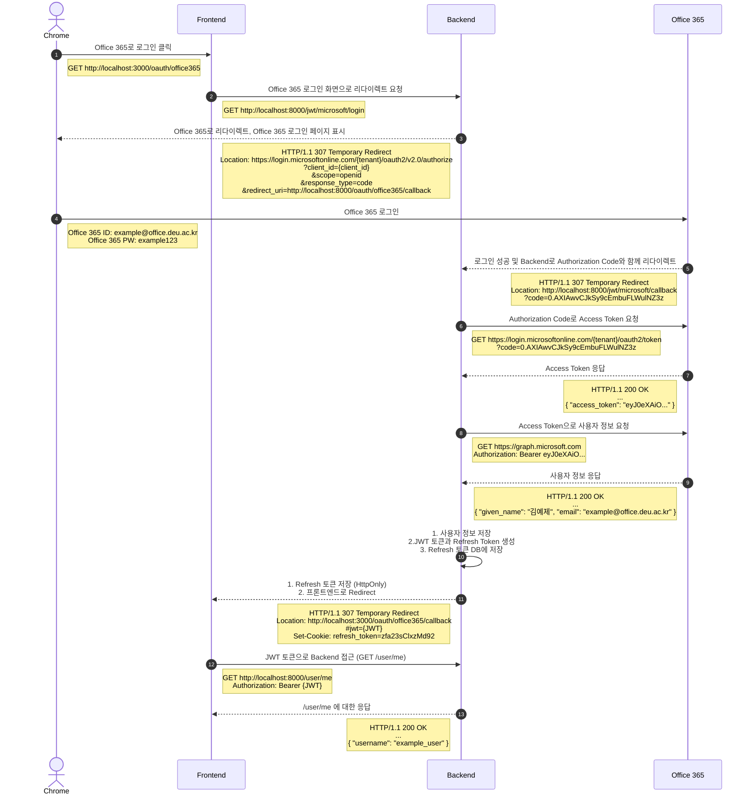
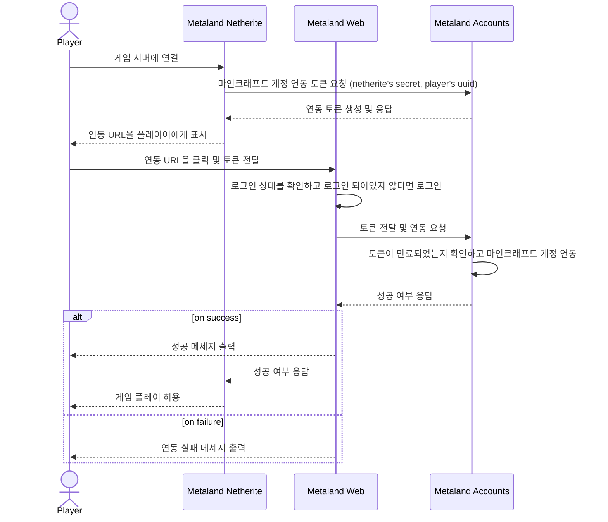

# Metaland Accounts

>Metaland Accounts Server

## Getting Started  

### Installation

<pre><code>git clone https://github.com/deu-meta/metaland-accounts.git

pip install -r requirements.txt

echo "MARIADB_USER=[<b>MARIADB_USER</b>]" >> .env
echo "MARIADB_PASSWORD=[<b>MARIADB_PASSWORD</b>]" >> .env
echo "MARIADB_HOST=[<b>MARIADB_HOST</b>]" >> .env
echo "MARIADB_PORT=[<b>MARIADB_PORT</b>]" >> .env
echo "MARIADB_DATABASE=[<b>MARIADB_DATABASE</b>]" >> .env
</code></pre>

### Run

<pre><code>docker-compose up</code></pre>

## Auth Flow

### Login with Office 365 OAuth 2.0

### Verify minecraft account and link with metaland account

## LICENSE

[MIT License](./LICENSE)
